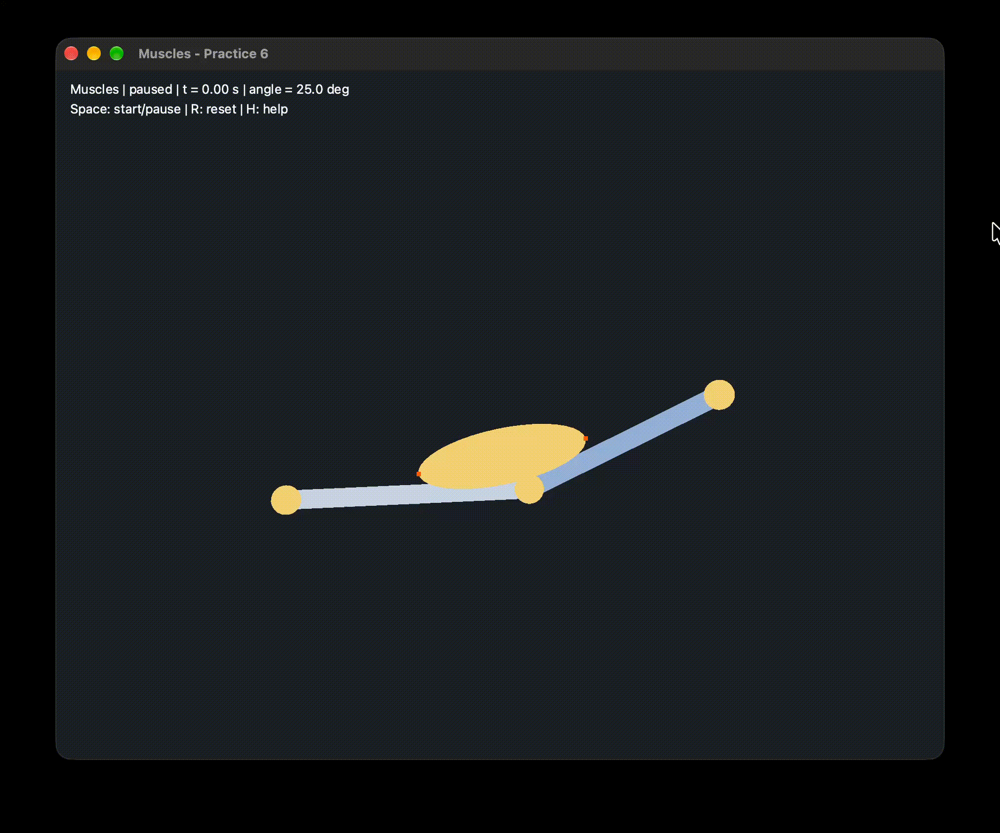

# Muscles

A C++ muscle simulation using Qt5 and QGLViewer for visualization. The muscle is modeled as a constant-volume ellipsoid attached to two bones.

## Prerequisites

- [CMake](https://cmake.org/)
- [Qt5](https://www.qt.io/)
- [Clang](https://clang.llvm.org/)
- [clang-format](https://clang.llvm.org/docs/ClangFormat.html)

## Usage

```sh
cmake -S . -B .build -DCMAKE_BUILD_TYPE=Release
cmake --build .build --parallel
cmake --build .build --target run
```



### Format

```sh
cmake --build .build --target format
cmake --build .build --target format-check
```
